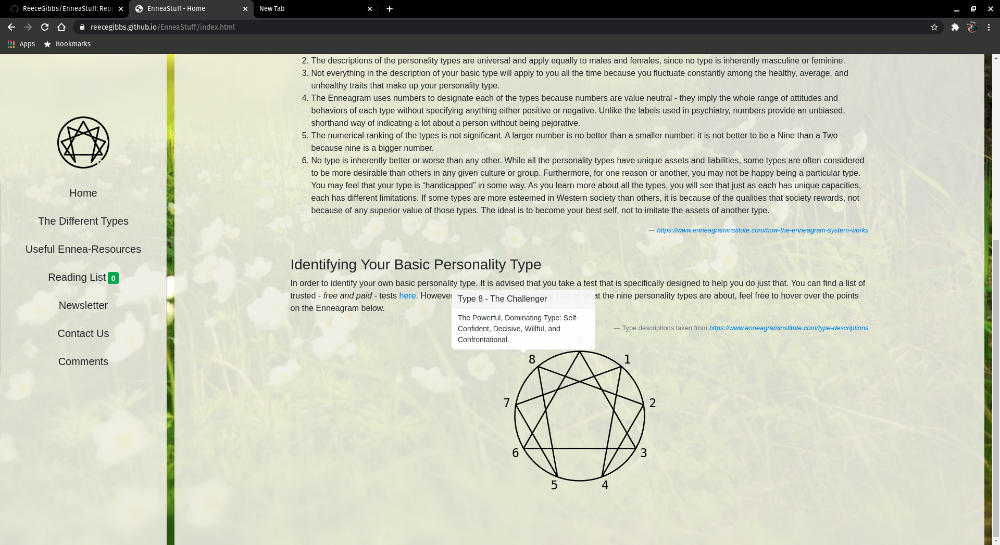
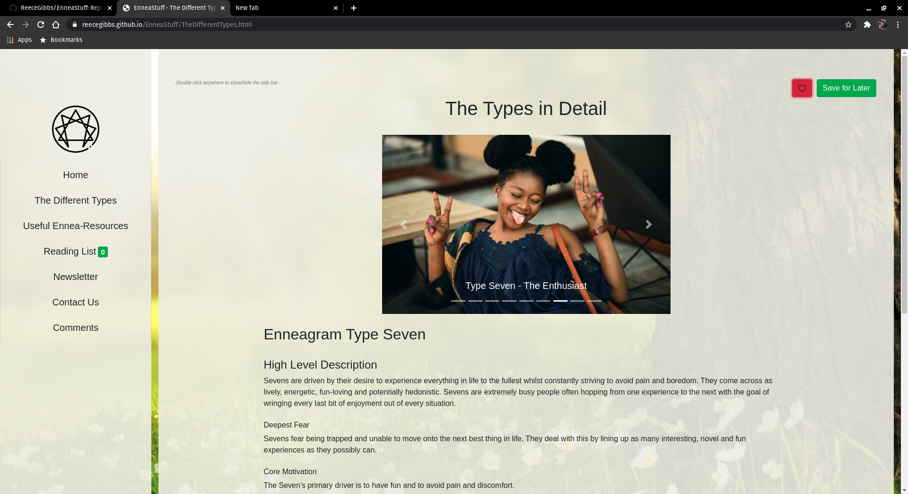
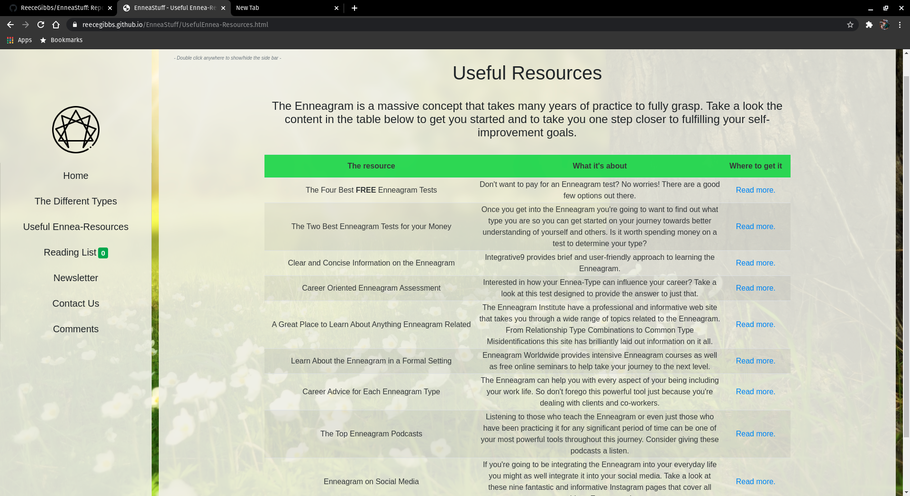
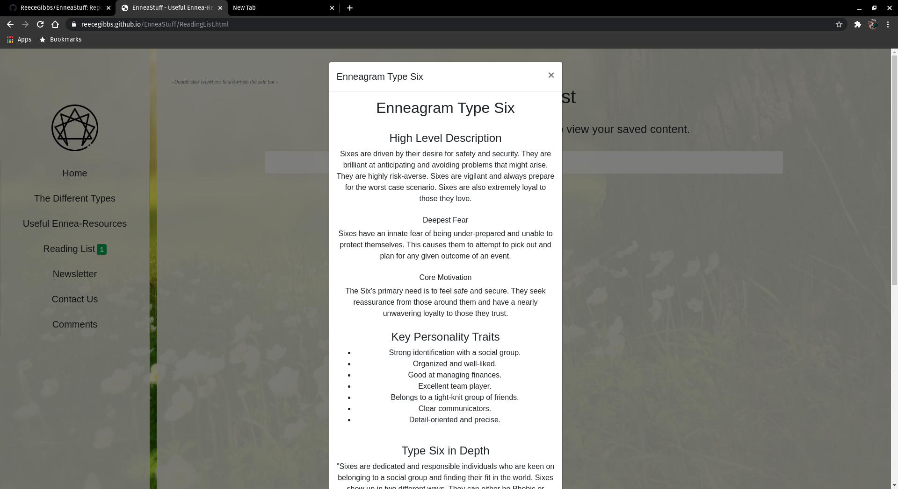
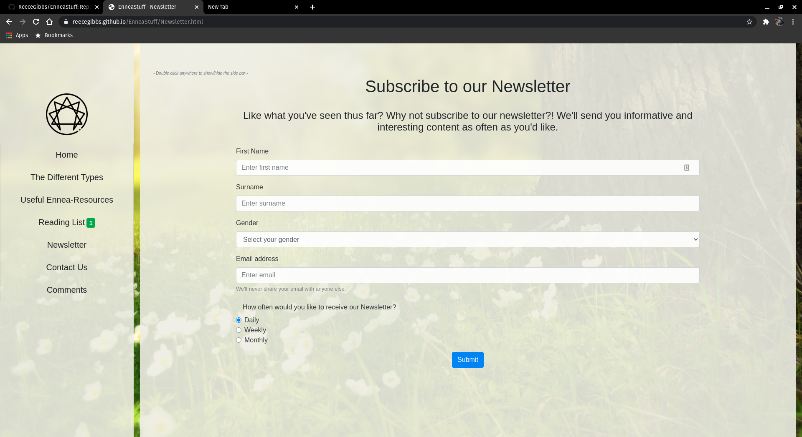
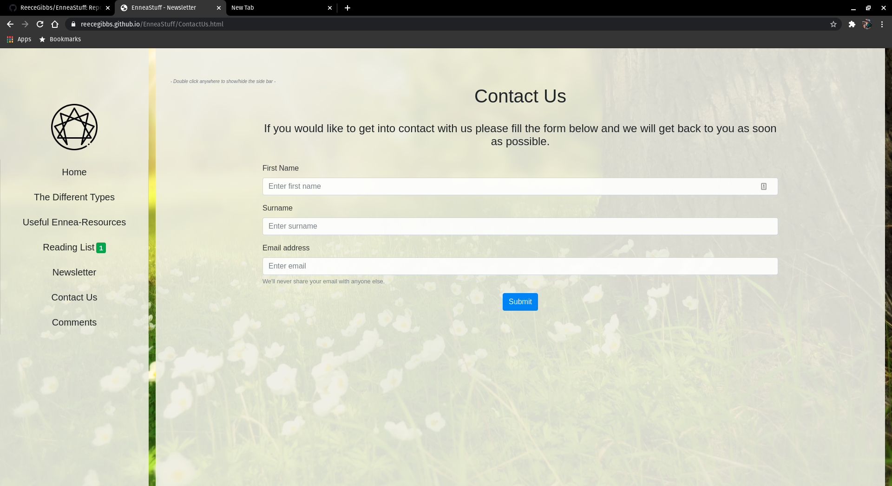
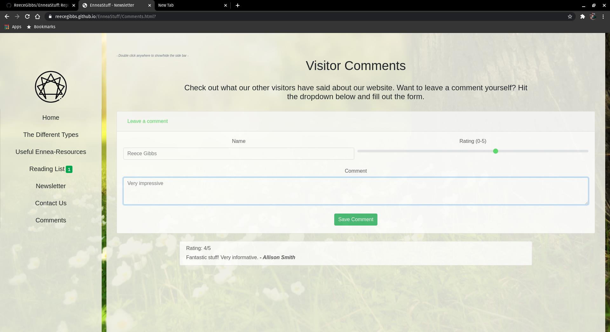

<h1> EnneaStuff</h1>
 

  <h3>Table of Contents</h3>
  <ol>
    <li><a href="#about">What's it all about?</a></li>
    <li><a href="#contribute">Where to find it and how to make it better</a></li>
    <li><a href="#demo">What it looks like</a></li>
    <li><a href="#credits">Credits</a></li>
  </ol>

 

  <h3>What's it all about?</h3>
  

    EnneaStuff is a website designed to familiarise people with the concept of the Enneagram. 
    The Enneagram is a system used to 'type' people based on their personality traits and the way in which they interact with their environment.
    Being able to type yourself and others can be a valuable skill and can greatly improve not only the degree to which you understand yourself,
    but your engagement with all those you come into contact with.
  

 

  <h3>Where to find it and how to make it better</h3>
  <h5>Want to check out the live site? <a href="https://reecegibbs.github.io/EnneaStuff/index.html">click here</a></h5>
  <h5>Want to make it better? Follow the steps below</h5>
  <h5><i>First make sure you have git installed</i></h5>
      

        You can install git for Windows, Mac and Linux at the following <a href="https://git-scm.com/downloads">link</a>. 
        If you're a Linux user and prefer the apt package manager you can simply run the following commands:
          <ul>
            <li><i>sudo apt-get update</i></li>
            <li><i>sudo apt-get install git</i></li>
          </ul>
         
        Once you have git installed navigate to your desired working directory and run the command: 
        <i>git clone https://github.com/ReeceGibbs/EnneaStuff.git</i>
      

 

  <h3>What it looks like</h3>
  <h4><i>The current state of the live website</i></h4>
  <h5>Home</h5>
  
  
  <h5>The Different Types</h5>
  
  <h5>Useful Ennea-Resources</h5>
  
  <h5>Reading List</h5>
  
  <h5>Newsletter</h5>
  
  <h5>Contact Us</h5>
  
  <h5>Comments</h5>
  

 

  <h3>Credits</h3>
  <h5>This website was created by <a href="https://github.com/ReeceGibbs">Reece Gibbs</a></h5>

